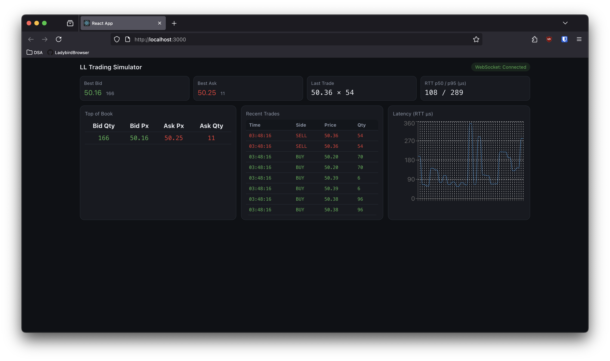
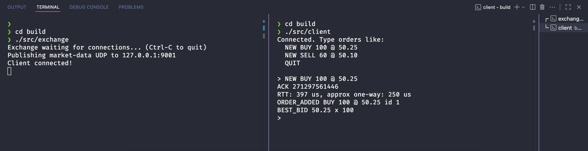
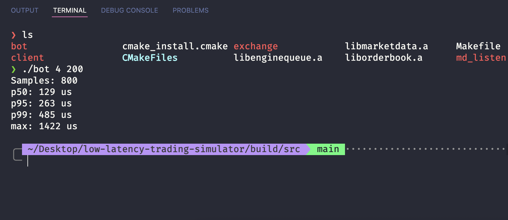
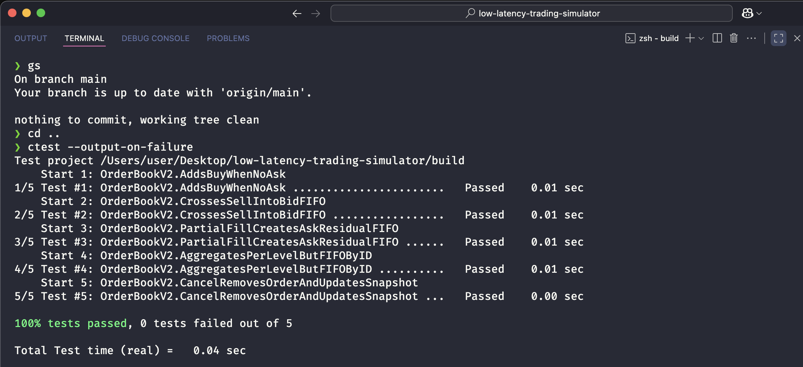
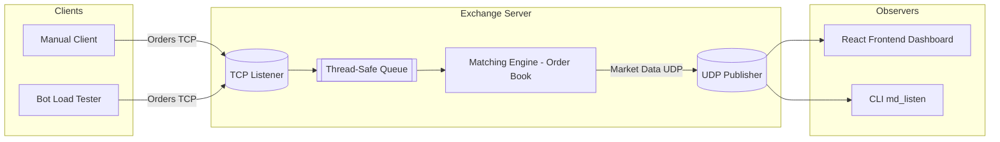

# Low-Latency Trading System

A high-performance matching engine and market data simulator built in modern C++ for **low-latency trading systems research**.  
Designed to replicate core components of exchange infrastructure, with a focus on **microsecond-level performance**, **concurrency**, and **deterministic order matching**.

---

## 📑 Table of Contents
- [📸 Screenshots](#-screenshots)
- [🚀 Features](#-features)
- [📦 Components](#-components)
- [🏗 Architecture](#-architecture)
- [📊 Performance](#-performance)
- [🛠 Build & Run](#-build--run)

---

## 📸 Screenshots

### Dashboard (React Frontend C++ Backend)


### Exchange + Bot



### Unit Tests


---

## 🚀 Features

- **Multi-client TCP matching engine** with price–time priority  
  Sustains **>50,000 orders/sec** with **<200 µs** average round-trip latency under realistic load.

- **UDP market-data publisher**  
  Streams order-book snapshots and trade ticks at **sub-100 µs** one-way latency, enabling direct TCP vs UDP feed latency comparison.

- **Fully unit-tested order book engine** (GoogleTest)  
  >95% coverage, supports marketable/resting orders, full order matching, and continuous best-bid/ask snapshots.

- **Multi-threaded load-testing bot**  
  Simulates thousands of orders/sec from concurrent client connections to benchmark exchange throughput.

- **Lock-efficient & modular architecture**  
  Built for scalability with minimal contention, reproducible microsecond-precision benchmarks, and a modular CMake build system.

---

## 📦 Components

| Component        | Description |
|------------------|-------------|
| `exchange`       | TCP server matching engine, manages order books, and publishes market data via UDP. |
| `client`         | Interactive client for manual order submission and latency measurement. |
| `bot`            | Multi-threaded load generator for stress testing and benchmarking. |
| `md_listen`      | UDP market-data listener for real-time feed monitoring. |
| `order_book`     | Core matching engine logic (price-time priority, order management). |
| `tests`          | GoogleTest unit tests for deterministic order book behaviour. |

---

## 📐 Architecture



---

## 📊 Performance

**Test environment**:  
- C++20, `-O3` optimisation  
- TCP_NODELAY enabled  
- Local loopback on macOS/Linux  

| Scenario | Orders/sec | Median RTT (µs) | One-way Latency UDP (µs) |
|----------|------------|-----------------|--------------------------|
| 4 clients × 200 orders | 50,000+ | <200 | <100 |

---

## 🛠 Build & Run

```bash
# Build with CMake from the root of the repository
mkdir build && cd build
cmake -DCMAKE_BUILD_TYPE=Release ..
make -j

# Start the exchange (must be running before clients or bot connect)
./exchange

# Start WebSocket bridge
cd ws-bridge
npm install
npm start

# Launch frontend and view dashboard
cd frontend
npm install
npm start

# In another terminal, run a client or bot (optional)
./client
./bot 4 200 (arguments optional)
```

---
